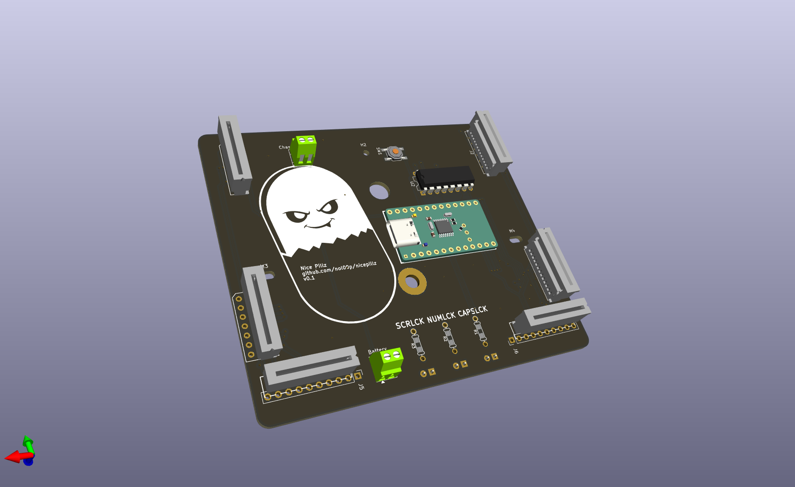

# NicePillz
this is a pillzmod pcb reworked to be dedicated to the nice!nano

Changes include:
- moved the register to the high frequency pins
- Terminal blocks for easy intall of the battery and power swtich
- moved col0 directly to the nice!nano so the keyboard can wake up by pressing the top ESC key.

## Attribution
This project is a fork of https://github.com/dcpedit/pillzmod
