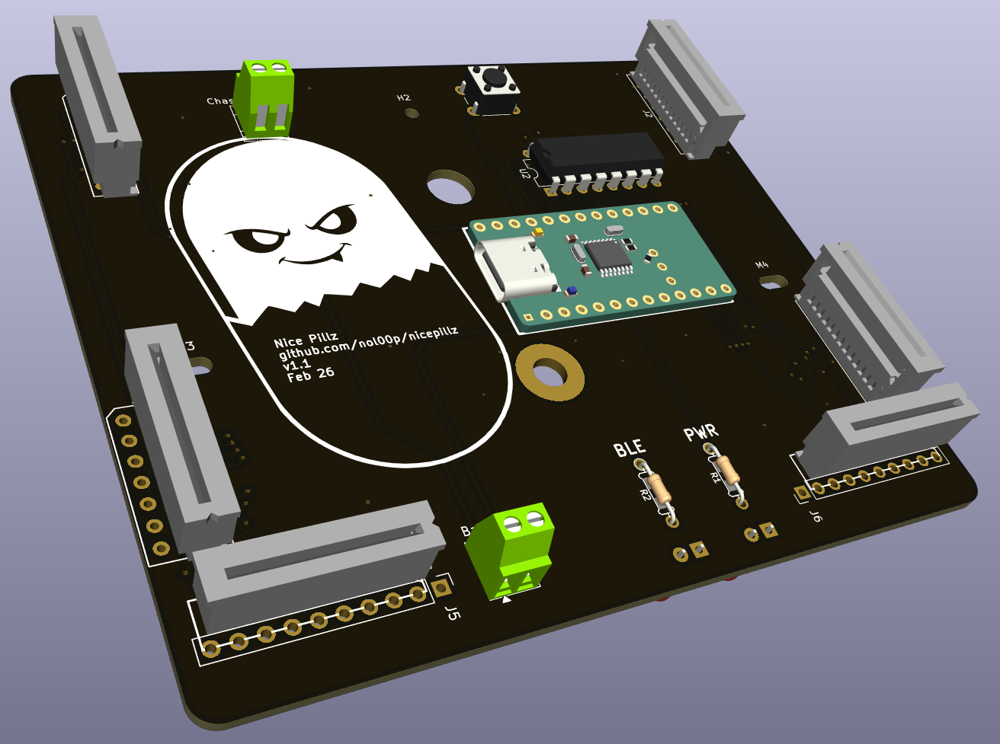

# NicePillz
this is a pillzmod pcb reworked to be dedicated to the nice!nano

Changes include:
- moved the register to the high frequency pins
- Terminal blocks for easy install of the battery and power switch
- moved col0 directly to the nice!nano so the keyboard can wake up by pressing the top ESC key.

## ZMK
see: https://github.com/nol00p/ZMK-NicePillz

## Attribution
This project is a fork of https://github.com/dcpedit/pillzmod

## Thumbcluster
Next the Thumbcluster, the plan here is to use the same terminal to be able to reuse the ribbon cables. and include hot swap sockets. Get in touch if that is something of interest.

